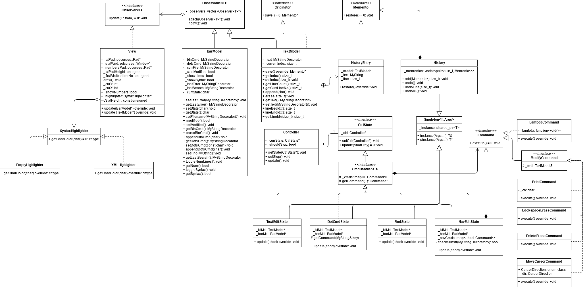

## VIM
Текстовый редактор, использующий Text User Interface

## Возможности
- Редактирование текста
- Сохранение и открытие текстовых файлов
- Пролистывание текста
- Отображение номеров строк
- Подсветка синтаксиса XML

## Поддерживаемые команды:

Нажмите, чтобы раскрыть

### Режим навигации и редактирования
| Комбинация  |  Действие |
|:-----------:|---|
|  →  |  Перемещение курсора вправо |
|  ←  |  Перемещение курсора влево |
|  ↑  |  Перемещение курсора вверх |
|  ↓  |  Перемещение курсора вниз |
|  Page Up  |  Перейти на экран вверх |
|  Page Down  |  Перемещение на экран вниз |
|  ^ или 0  |  Перемещение курсора в начало строки |
|  $  |  Перемещение курсора в конец строки |
|  w  |  Перемещение курсора в конец слова справа от курсора |
|  b  |  Перемещение курсора в начало слова слева от курсора |
|  W  |  Перемещение курсора к следующему пробелу / группе пробелов |
|  B  |  Перемещение курсора к предыдущему пробелу / группе пробелов |
|  gg  |  Перейти в начало файла |
|  G  |  Перейти в конец файла |
|  x  |  Удалить символ после курсора |
|  X  |  Удалить символ перед курсором |
|  dw  |  Удалить символы от курсора до конца слова включая пробел справа |
|  dE  |  Удалить символы от курсора до конца слова исключая пробел справа |
|  diw  |  Удалить слово под курсором, включая пробел справа |
|  dd |  Вырезать текущую строку |
|  d^ или d0  |  Удалить символы с начала строки до текущего положения курсора |
|  d$ или D |  Удалить символы с текущего положения курсора до конца строки |
|  Y  |  Копировать текущую строку |
|  yw  |  Копировать слово под курсором |
|  y^ или y0  |  Копировать символы с начала строки до текущего положения курсора |
|  y$  |  Копировать символы с текущего положения курсора до конца строки |
|  p  |  Вставить после курсора |
|  P  |  Вставить перед курсором |
|  J  |  Слияние текущей строки со следующей |
|  u  |  Отмена последней команды |

### Режим поиска
| Комбинация  |  Действие |
|:-----------:|---|
|  /*text*<CR> |  Поиск *text* от курсора до конца файла |
|  ?*text*<CR> |  Поиск *text* от начала файла до курсора |
|  n  |  Повторить поиск |
|  N  |  Повторить поиск в обратном направлении |

### Режим ввода
| Комбинация  |  Действие |
|:-----------:|---|
|  i |  Ввод текста перед курсором |
|  a |  Ввод текста после курсора |
|  I  |  Перейти в начало строки и начать ввод текста |
|  A  |  Перейти в конец строки и начать ввод текста |
|  o  |  Создать строку сверху и начать ввод текста |
|  O  |  Создать строку снизу и начать ввод текста |
|  S  |  Удалить содержимое строки и начать ввод текста |
|  r  |  Заменить один символ под курсором |

### Команды режима команд (чтобы перейти в режим команд необходимо нажать : в режиме навигации)
| Комбинация  |  Действие |
|:-----------:|---|
|  o *filename* |  Открыть файл *filename* |
|  x |  Записать в текущий файл и выйти |
|  w  |  Записать в текущий файл |
|  w *filename*  |  Записать в *filename* |
|  q  |  Выйти, если файл не был изменен |
|  q!  |  Выйти без сохранения |
|  wq!  |  Записать в текущий файл и выйти |
|  e!  |  Отменить все изменения |
|  *number*  |  Переход на строку *number* |
|  set num  |  Включить / Отключить нумерацию строк |
|  sy  |  Включить подсветку синтаксиса |

 

## UML диаграмма разработанных классов
